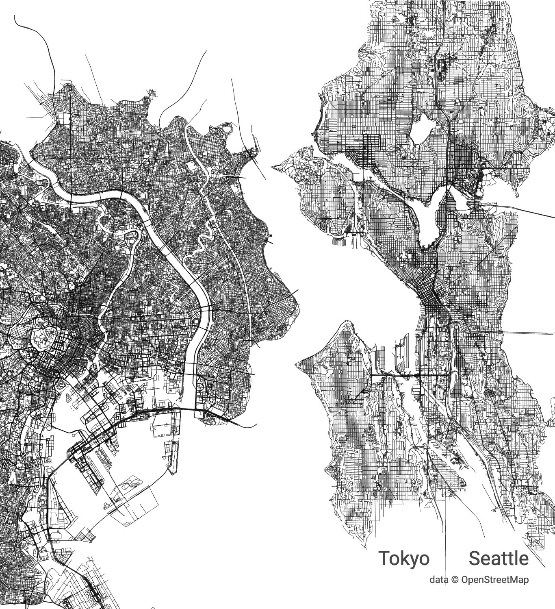

# Console API

*This is work in progress and subject to change. Please don't rely on it for anything critical* 

The `city-roads` provides additional set of operations for the software engineers, allowing them
to execute arbitrary OpenStreetMap queries and visualize results.

## Methods

This section describes available console API methods.

### `scene.load()`

Allows you to load more city roads into the current scene. Before we dive into details, let's explore what
it takes to render Tokyo and Seattle next to each other. 



First, open [city roads](https://anvaka.github.io/city-roads/)
and load `Seattle` roads. Then open [developer console](https://developers.google.com/web/tools/chrome-devtools/open) and run the following command:

``` js
scene.load(Query.Road, 'Tokyo'); // load every single road in Tokyo
```

Monitor your `Networks` tab and see when request is done. Tokyo bounding box is very large,
so it will appear very far away on the top left corner. Let's move Tokyo grid next to Seattle:

``` js
// Find the loaded layer with Tokyo:
tokyo = scene.queryLayer('Tokyo');

// Exact offset numbers can be found by experimenting
tokyo.moveBy(/* xOffset = */ 718000, /* yOffset = */ 745000)
```

`scene.load()` has the following signature:

``` js
function load(wayFilter: String, loadOptions: LoadOptions);
```

* `wayFilter` is used to filter out OpenStreetMap ways. You can find a list of well-known filters [here](https://github.com/anvaka/city-roads/blob/f543a712a0b88b12751aad691baa5eb9d6c0c664/src/lib/Query.js#L6-L24). If you need 
to know more to create custom filters, here is a complete [language guide](https://wiki.openstreetmap.org/wiki/Overpass_API/Overpass_QL). You can also get good insight into key/value distribution for ways by exploring [taginfo](https://taginfo.openstreetmap.org/tags) (make sure to sort by Ways in descending order to get the most popular combinations);
* `loadOptions` allows you to have granular control over the bounding box of the loaded results. If this
value is a string, then it is converted to a geocoded area id with nominatim, and then the first match
is used as a bounding box. This may not be enough sometimes, so you can provide a specific area id, or 
a bounding box, by passing an object. For example:

``` js
scene.load(Query.Road, {areaId: 3600237385}); // Explicitly set area id to Seattle

scene.load(Query.Building, { // Load all buildings...
  bbox: [       // ...in the given bounding box
    "-15.8477", /* south lat */ 
    "-47.9841", /* west  lon */ 
    "-15.7330", /* north lat */ 
    "-47.7970"  /* east  lon */ 
  ]});
```

### scene.queryLayerAll()

Returns all layers added to the scene. This is what it takes to assign different colors to each layer:

``` js
allLayers = scene.queryLayerAll()
allLayers[0].color = 'deepskyblue'; // color can be a name.
allLayers[1].color = 'rgb(255, 12, 43)'; // or a any other expression (rgb, hex, hsl, etc.)
```

### `scene.clear()`

Clears the current scene, allowing you to start from scratch.


### `scene.saveToPNG(fileName: string)`

To save the current scene as a PNG file run

``` js
scene.saveToPNG('hello'); // hello.png is saved
```

### `scene.saveToSVG(fileName: string, options?: Object)`

This command allows you to save the scene as an SVG file.

``` js
scene.saveToSVG('hello'); // hello.svg is saved
```

If you are planning to use a pen-plotter or a laser cutter, you can also
greatly reduce the print time, by removing very short paths from the final
export. To do so, pass `minLength` option:

``` js
scene.saveToSVG('hello', {minLength: 2}); 
// All paths with length shorter than 2px are removed from the final SVG.
```